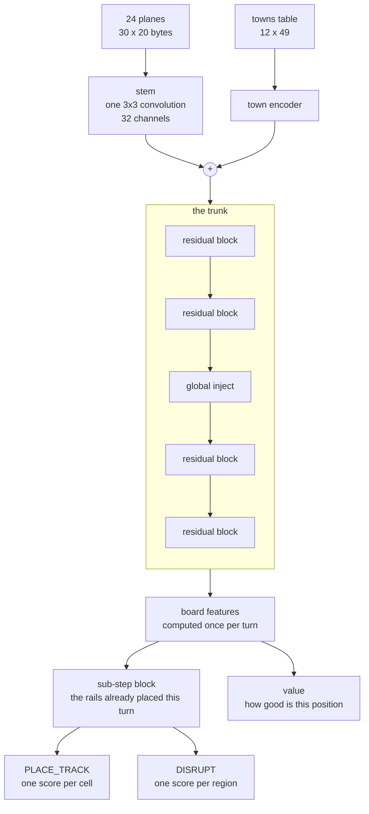

# Summer Challenge 2026, Back Track King: 3rd

I finished 3rd. Thanks to the CodinGame team for the contest, it was a lot of fun.

The bot is a neural network that learned the game by playing against itself, trained with PPO, with a small search
on top at the end.

## It started with a beam search

Start of the contest, I did what I usually do: a greedy bot, then a search on top. A Dijkstra over the board gives
the interesting paths, plus a few heuristics mixed into one evaluation of a given state.

A turn is a whole set of actions, so I built it in layers: one pass over everything legal to keep the N best
`DISRUPT` and the M best `PLACE_TRACK`, then the combinations, each `DISRUPT` crossed with the best `PLACE_TRACK`,
then the next `PLACE_TRACK` among those left. Every combination scored by the evaluation of the state it leads to.

- v0: greedy, pick the best combination.
- v1: beam search over my K best combinations, the opponent answering greedily (same process as mine), one more depth
  while time is left.

It played decently. But i feel it was going to
stall, or turn into one giant tangled heuristic. So I thought: why not try PPO.

## What the network sees

24 planes of 30x20 bytes, the real board pushed into the top-left corner of the padding, plus a small table of the
towns. Everything the final network is given, nothing else.

The map, computed once per game (8 planes):

- on the board
- plains, river, mountain (one plane each)
- this cell is a town
- the region of this cell holds a town
- the region changes to the north, the region changes to the east

The position, rewritten at every sub-step (10 planes):

- my rails, the opponent's rails, neutral rails
- the instability of the region, the region is inked
- the rails I have already placed this turn
- how many standing connections cross this cell
- my rails in this region, the opponent's rails in this region
- how much instability the region takes before it can be inked, 0 when it holds a town or is already inked

The clock and the money, one byte repeated over the whole plane (6 planes):

- the turn
- the sub-step
- the paint I have left
- my income, the opponent's income, the score gap

Three things reach the network outside the planes:

- The towns table, 12 slots of 49 numbers: the cell of the town, then for every other town a bit field (this town
  asks for the connection, the connection stands, the pair is still joinable through un-inked cells), then the length
  of the standing path between them and how many of its cells carry my rails and the opponent's.
- The region id of every cell, which pools the board into one logit per region for the `DISRUPT` choice.
- The mask of legal actions, and the six scalars above once more as plain floats, straight into the STOP head and the
  value head.

## The network

In words: the stem turns the 24 planes into 32 channels. The town encoder reads the towns table and adds what it
understood to the cell each town sits on. Four residual blocks refine that, with one global injection after the
second. Then the heads: one score per cell for `PLACE_TRACK`, one per region for `DISRUPT`, one number for the
value. Illegal actions are cut out.

The global injection is what makes 3x3 convolutions work on a board this size. A cell sees one cell around it, so
after two blocks it knows a 5x5 neighbourhood and nothing else, and the top-left corner knows nothing of the
bottom-right. The injection averages each of the 32 channels over the board, passes those 32 numbers through a
linear layer, and adds the result to every cell. One layer, and every cell carries a bias that depends on the whole
game. KataGo's global pooling, 1,056 weights. It carries no position: a cell learns there is a fight, never that the
fight is on its right. Thanks Claude for that one ahah, I had never really got it and it turned out to be very
useful.

The value head reads the 600 cells plus the six scalars: turn, sub-step, paint, the three log values.

A turn is four sub-steps, three placements and one ink. The heavy part runs once per turn and the sub-step block
adjusts for the rails already placed, which is what made a search affordable later. Training ran the plain version,
the whole network once per sub-step with the chosen rails written into the planes: four times the cost, fine on my
machine, too slow for the contest.

## Training

Self-play with PPO, always the same loop: 512 games run at once in C++, both seats are played by the current network,
and the moves of both seats are used for training. A rollout collects a few turns from every game, the network is
updated on them, and it starts again.

- The reward is the income gap of the turn, my income minus the opponent's. Nothing for placing a rail, nothing for
  completing a connection, nothing for inking.
- One thing is added at the very end: plus 30 to the winner, minus 30 to the loser. Without it a game won by 200
  points pays ten times a game won by 20, while the ranking sees the same W.
- Half the games are against the network itself; the other half against old versions of it, kept in a pool, and the
  ones that beat us are drawn more often. Without that, the bot only plays near-copies of itself and its score stops
  meaning anything.
- Checkpoints are saved constantly and then averaged together. The average of hundreds of checkpoints is reliably
  stronger than any single one of them, by 10 to 15 points, so every decision was taken between two averages.
- When I wanted to change the architecture, I did not restart. A new piece is added with its output set to zero, so
  the network plays exactly as before, and the training continues. It has to be given its own learning rate, or it
  grows so slowly that it never matters.

The final weights come from about 50,000 of those iterations.

## Distillation

Same trick three times: a teacher plays, a student learns to give the same answers.

- The teacher runs the whole network once per sub-step, four times a turn. The student (shipped one) runs it
  once, and a small block re-reads the rails placed since. Same moves, one quarter of the work, and that is what paid
  for the search.
- The value head. 4 times smaller in the bundle comapring to training, nearly same predictions.
- A big network that taught a small one, because only a small one fits in the file. Four of my submitted bots came
  out of it. Then a small network trained directly caught its own teacher, so I could probably have skipped it.

## Looking inside the network

I spent a lot of time checking inside the network, and it help me a lot to iterate faster.

- Probes: take the features in the middle of the network and try to read something out of them with a simple linear
  fit. Does a cell know its distance to the nearest town? Does it know it sits on a good route? If a simple fit finds
  it, the network has it.
- Usage report, on every checkpoint: which channels are dead, which are asleep, how much of each layer is really
  used, and ablations, which means switching a piece off and measuring how many moves change.
- A credit check: does the training signal actually reward the cells the Dijkstra calls good?
- A viewer that replays a game sub-step by sub-step with the inside of the network on screen, the policy map, the
  value map, the channels, and a 3D version of the same thing.

## How everything was checked

- The engine is bit-exact with the referee. Every turn of every logged game is replayed by my own simulation and must
  produce exactly what the referee produced next.
- The C++ bot and the Python training must agree bit for bit before any submission.
- A change is accepted only after 1,024 games with both sides playing their best move, average against average. One
  seed is not enough, and I caught myself believing a lucky checkpoint at one in the morning on the last night.
- The real referee runs the local arena, because my own duel program does not enforce the time limit. Games where
  somebody timed out are thrown away, since that is my own machine being busy, not the bot being slow.
- The file that gets pasted is built by a script: pick the weights, compress them, minify, compile, play a game,
  record the checksum. No bundle was ever assembled by hand.

## The search

The final bot does not play its favourite move. It builds a few candidate plans for the turn, scores them with the
value head two turns ahead, and keeps the best one it had time to look at. Against the same network without it, that
is a 0.839 win rate. It is entirely limited by time: one pass of the network costs about a
millisecond on CodinGame, so the bot only fully scores two to four plans per turn, and every microsecond saved turns
into another plan.

## What did not work

The Dijkstra answer as an input. A recurrent trunk. A second attention layer on the towns. Two attempts at shaping
the reward. Two value heads meant to cancel each other's mistakes, whose mistakes turned out to be the same. Inking
as a term in the evaluation, twice, which taught the search to keep a threat instead of using it. Copying the moves
of the player ahead of me. Most of the time spent actually x)

## Thanks

To the CodinGame team for the game, to everyone who fought me at the top of the leaderboard, and to the people who
publish their post-mortems: that is where I learned how to run this kind of project.
